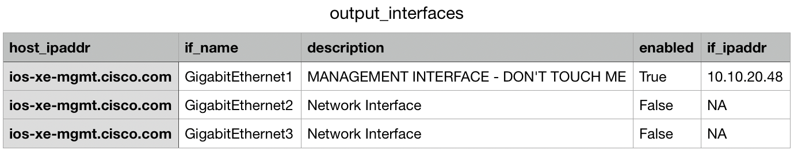

# PortAudit

## Description

Script that iterates over a list of network devices (i.e switches, routers) specified on a CSV file and generates a report of their port status (Interface name, description, IP address and Administrative status).
It does this using the RESTCONF Protocol.

## About the LAB to run the demo.

The _routers.csv_ file contains the CSR1000v Always-on DevNet sandbox as part of this demo. 
Sandbox URL: https://devnetsandbox.cisco.com/RM/Diagram/Index/27d9747a-db48-4565-8d44-df318fce37ad?diagramType=Topology

**CSR1000V Host:** ios-xe-mgmt.cisco.com

**SSH Port:** 8181

**NETCONF Port:** 10000

**RESTCONF Ports:** 9443 (HTTPS)

Credentials of this public available Sandbox to specify when prompted for it:

**Username:** developer

**Password:** C1sco12345

## Usage

1. Clone this repo in your local machine typing on your terminal:

```https://github.com/agmanuelian/PortAudit.git```

2. Install the required dependencies specified on the _requirements.txt_ file:

```pip install requirements.txt```

3. Edit the _routers.csv_ file with the parameters (IP address and RESTCONF port) of the list of devices that you want to configure.


4. Modify on the _port_audit.py_ script the directory from where the _routers.csv_ file is read, specifying your local directory. Also, modify the directory where _output_interfaces.py_ will be written to.
5. Run the _port_audit.py_ script.
7. You will be prompted to enter your TACACS credentials (demo credentials specified on previous section) to access the list of devices.
8. The script will run the report, display it on the terminal and write the _output_interfaces.csv_ file (the port audit results) to the specified directory.

### Terminal output


### Output CSV file, with the port audit results


REF: **TACACS** is a network device access management protocol. If you have that configure to access all your network devices, you could use your TACACS credentials to access the network devices. Otherwise, using local authentication will work, too.
